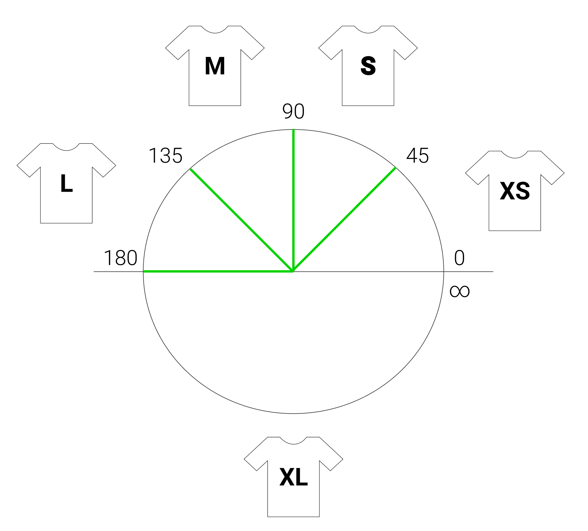

# UI

A set of UI components for Svelte.

## Icons

We can pass a Svelte component to the [`Icon`](./src/icons/Icon.svelte) component in order to render the desired icon, like this:

```svelte
<script>
	import {default as Icon} from '@svizzle/ui/src/icons/Icon.svelte';
	import {default as Download} from '@svizzle/ui/src/icons/feather/Download.svelte';
</script>

<Icon
	glyph={Download}
	size=30
	strokeWidth=1.5
/>
```

`Icon` props:
- `glyph`
	- description: the svelte component of the icon to be rendered (of course you can provide your own)
	- type: `svelte component`
	- default: `null`
- `size`:
	- description: icon size
	- type: `number`
	- default: `24`
- style:
	- `fill`:
		- description: the color to be used to fill closed shapes
		- type: `string`
		- default: `'none'`
	- `stroke`:
		- description: lines color
		- type: `string`
		- default: `'currentColor'`
	- `strokeWidth`:
		- description: lines thickness
		- type: `number`
		- default: `2`

As a commodity, icons from https://github.com/feathericons/feather/tree/master/icons are automatically turned into Svelte components and provided in `./src/icons/feather` for ease of use.

Note that the `makeFeatherIcons` npm script assumes the `feather` directory in the root of the Svizzle repository because Lerna is set up to hoist packages in the root `node_modules` dir.

## Link

Props:
- `download`: `string`, defaults to `null`; serves as a file name as opposed to the file name provided in `href`; use for files that the browser would otherwise display, in order to get a download dialog instead.
	For example:
		- if the `href` is a `zip` or `csv` file, it's not needed;
		- if the `href` is `data/foo.png` (which could be displayed), by providing `download='bar'` we download a file named `bar.png`.
	Order of precedence of the filename extension offered in save-file dialog:
		1. extension in the `download` attribute
		2. mime type of the response (for example when we try to download a picture but we get a 404)
		3. extension in the `href` attribute.
- `href`: `string`, defaults to `null`
- `hreflang`: `string`, defaults to `null`
- `iconSize`: `number`, defaults to `14`
- `isBold`: `boolean`, defaults to `false`
- `isUnderlined`: `boolean`, defaults to `false`
- `rel`: `string`, defaults to `'noopener'`
- `showIcon`: `boolean`, defaults to `true`
- `target`: `string`, defaults to `null`
- `text`: `string`, defaults to '' (if `href` isn't provided it turns into `<Link.svelte>: PLEASE PROVIDE A `href` PROP'`)
- `theme`: `object`, it gets merged to the default object, that is:
	```
	{
		iconStroke: 'rgb(16, 174, 249)',
		iconStrokeWidth: 2,
		textColor: 'black',
	}
	```
- `type`: `string`, defaults to `null` (see https://developer.mozilla.org/en-US/docs/Web/HTML/Link_types)

## LinkButton

Props:
- `download`: `string`, defaults to `null`; see `Link` above.
	- if the `href` is a `zip` or `csv` file, it's not needed;
	- if the `href` is `data/foo.png` (which could be displayed), by providing `download='bar'` we download a file named `bar.png`
- `glyph`: a Svelte component for an optional icon
- `href`: `string`, defaults to `null`
- `hreflang`: `string`, defaults to `null`
- `iconSize`: `number`, defaults to `14`
- `rel`: `string`, defaults to `'noopener'`
- `target`: `string`, defaults to `null`
- `text`: `string`, defaults to 'Please provide `text`'
- `theme`: `object`, it gets merged to the default object, that is:
	```
	{
		backgroundColor: 'black',
		boxShadowColor: 'lightgrey',
		boxShadowVec: '2px 8px 9px -4px',
		iconFill: defaultFill,
		iconStroke: defaultStroke,
		iconStrokeWidth: defaultStrokeWidth,
		textColor: 'white',
	}
	```
- `type`: `string`, defaults to `null` (see https://developer.mozilla.org/en-US/docs/Web/HTML/Link_types)


## LoadingView

An empty view with a rotating icon at its center, with the same props of `Icon` so that you can control the displayed icon.

Props:
- `fill`: string, defaults to `null`
- `glyph`: Svelte component, defaults to `Loader` (Feather's `loader`)
- `size`: number, defaults to `50`
- `stroke`: string, defaults to `null`
- `strokeWidth`: number, defaults to `0.75`

## MessageView

An empty view with a text at its center.

Props:
- `backgroundColor` (string, default: 'white')
- `color` (string, default: 'black')
- `fontSize` (string, default: '14px')
- `text` (string, default: 'Please provide a message')

## Switch

A simple toggle between 2 values.

## Gauge components

These are components that we instantiate to measure some feature of the device/browser.

### Screen Gauge

Measures screen features reactively, see [here](src/gauges/screen).

## Breakpoints

```
import {breakpoints} from '@svizzle/ui/src/defaults';
```

A set of breakpoints for responsiveness, expressed in amount of chars fitting the screen width for responsive layouts (`[45, 90, 135, 180]`), see [here](https://github.com/nestauk/eurito_indicators_ui/issues/7#issuecomment-790848997).

The bands among breakpoints can be thought as T-shirt sizes:
```
       45      90      135     180
xSmall | small | medium | large | xLarge
```


